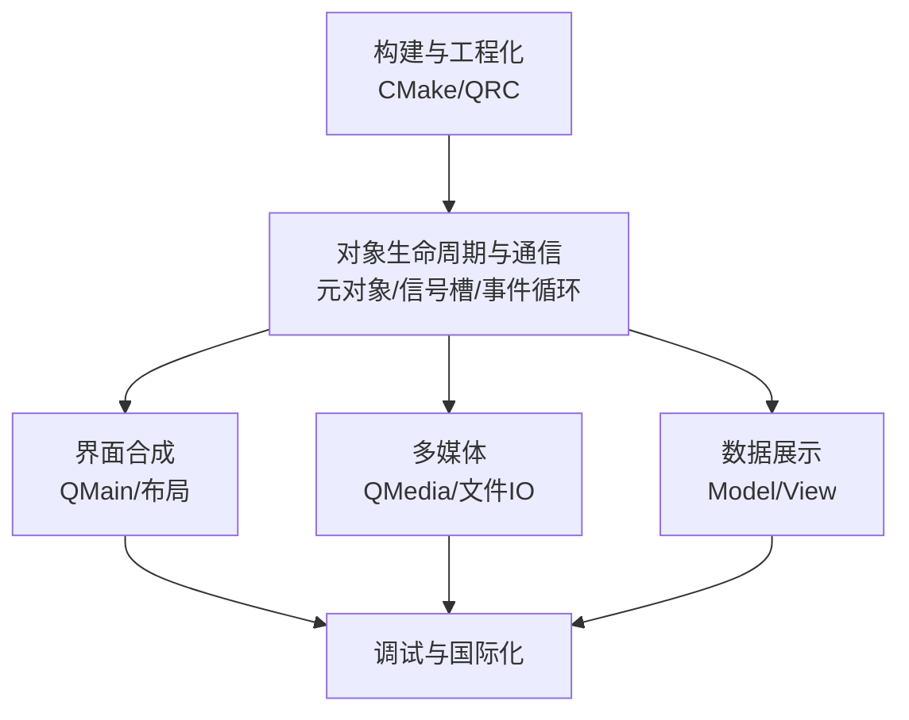

以下是根据你提供的内容整理的 Markdown 文档，并对拓扑图、部署清单和概念辨析做了适当细化补充。

```markdown
# 知识领域依赖拓扑图



<details>
<summary>原文本拓扑图（点击展开）</summary>

```
         构建与工程化 (CMake/QRC)
              │
              ▼
     对象生命周期与通信 (元对象/信号槽/事件循环)
              │
     ┌───────┼────────┐
     ▼       ▼        ▼
界面合成  多媒体   数据展示
(QMain/   (QMedia/  (Model/View)
 布局)    文件IO)     │
     └───────┼────────┘
             ▼
      调试与国际化
```

</details>

- **对象生命周期与通信** 是整个桌面程序的中枢神经：UI控件、多媒体组件、数据模型均为 `QObject` 子类，依赖父子链回收内存；一切行为响应均通过事件循环和信号槽驱动。
- **界面合成** 依赖布局系统和 `QWidget` 基础，而 `QMainWindow` 框架为音乐播放器提供标准窗口骨架。
- **多媒体与文件IO** 必须在事件循环就绪后方可工作（`QMediaPlayer` 状态机依赖事件分发）；文件扫描与元数据读取为播放列表提供数据源。
- **数据展示** 采用 Model/View 架构，将播放列表数据（来自文件IO）绑定至界面控件，依赖信号槽保持同步。
- **调试与国际化** 贯穿全部领域：`qDebug` 追踪多媒体状态变迁、`tr()` 包裹界面字符串以支持多语言。
- **构建与工程化** 是所有代码的载体，CMake 管理模块依赖、触发元对象编译、嵌入资源，最终产出 Windows 可执行文件。

# 核心概念层级词典

## 环境与构建

| 核心类/概念 | 关键API/语法 | MusicPlayer 直接应用场景 |
| --- | --- | --- |
| `CMakeLists.txt` 中的 `find_package(Qt6 REQUIRED COMPONENTS Widgets Multimedia)` | `AUTOMOC`, `AUTORCC`, `AUTOUIC` 属性 | 声明音乐播放器所需模块，自动处理 moc/uic/rcc 生成 |
| `qt_add_executable()` | `qt_add_executable(MusicPlayer src/main.cpp …)` | 生成目标可执行文件，自动链接 Qt 库 |
| `QRC` 资源文件 | `<RCC>` 标记、`:icons/play.png` 路径前缀 | 嵌入按钮图标、默认封面图、翻译文件，避免外部依赖 |
| MSVC 编译器 `CMake` 生成器 | `cmake -G "Visual Studio 17 2022" -A x64` | 匹配 Windows 桌面开发环境，确保 ABI 兼容 |

## 对象生命周期与通信

| 核心类/概念 | 关键API/语法 | MusicPlayer 直接应用场景 |
| --- | --- | --- |
| `QObject` | `parent` 参数、`setParent()`、`children()` | 所有窗口、控件、播放器实例均由 `QApplication` 或 `MainWindow` 托管，退出时自动析构子树 |
| 信号与槽（新式语法） | `connect(sender, &Sender::signal, receiver, &Receiver::slot)` | 音量滑块 `valueChanged` → `QAudioOutput::setVolume`；播放按钮 `clicked` → `QMediaPlayer::play` |
| `Q_OBJECT` 宏 | 必须位于类声明私有区 | 所有自定义 `QWidget`/`QMainWindow` 子类、包含自定义信号的业务对象均需声明，否则 MOC 不生成元代码 |
| `QApplication::exec()` | `int main(){ QApplication a; ...; return a.exec(); }` | 启动 Windows 消息循环，将系统事件转化为 Qt 事件分发 |
| 事件循环与事件重写 | `event()`, `timerEvent()`, `closeEvent()` | 在 `MainWindow::closeEvent` 中保存窗口几何与播放进度 |

## UI组装与布局

| 核心类/概念 | 关键API/签名 | MusicPlayer 直接应用场景 |
| --- | --- | --- |
| `QMainWindow` | `menuBar()`, `addToolBar()`, `statusBar()`, `setCentralWidget()` | 提供菜单栏(文件/播放控制)、工具栏(播放/暂停)、状态栏(曲目信息) |
| `QPushButton` | `setIcon()`, `setIconSize()`, `clicked` 信号 | 播放/暂停、上一首/下一首按钮 |
| `QLabel` | `setText()`, `setPixmap()`, `setAlignment()` | 显示专辑封面、当前时间/总时长文字 |
| `QSlider` | `setOrientation()`, `setRange()`, `valueChanged` 信号 | 音量滑块(Qt::Horizontal)、播放进度滑块 |
| `QVBoxLayout` / `QHBoxLayout` | `addWidget()`, `addStretch()`, `setContentsMargins()` | 中央部件内垂直排列播放列表与进度条，水平排布控制按钮 |
| `QGridLayout` | `addWidget(widget, row, col, rowSpan, colSpan)` | 需要标签-值对齐的媒体信息面板(如比特率、采样率) |

## 多媒体与文件IO

| 核心类/概念 | 关键API/签名 | MusicPlayer 直接应用场景 |
| --- | --- | --- |
| `QMediaPlayer` | `setSource()`, `play()`, `pause()`, `position()`, `playbackState()` | 音频播放引擎，驱动所有播放控制 |
| `QAudioOutput` | `setVolume(float)`, `setMuted(bool)` | 绑定到 `QMediaPlayer`，控制输出音量与静音 |
| `QMediaPlaylist` | `addMedia()`, `setPlaybackMode(Loop/Random)` | 管理播放列表队列，支持顺序/随机/单曲循环 |
| `QFileDialog` | `getOpenFileUrls()` / `getOpenFileNames()` | 打开本地音频文件（多选），返回 `QUrl` 列表传递给播放器 |
| `QDir` | `entryList(filters)`, `cd()` | 扫描音乐目录，批量导入指定格式文件 |
| `QFileInfo` | `fileName()`, `suffix()`, `lastModified()` | 提取文件名用于列表展示，区分音频扩展名 |

## 数据绑定与展示

| 核心类/概念 | 关键API/签名 | MusicPlayer 直接应用场景 |
| --- | --- | --- |
| `QListView` | `setModel()`, `setSelectionModel()` | 以列表形式呈现播放队列，支持点击切换曲目 |
| `QStandardItemModel` | `setHorizontalHeaderLabels()`, `appendRow()`, `item(row, col)->setData()` | 存储每一首歌曲的标题、艺术家、时长等列信息 |
| Model 索引与角色 | `Qt::DisplayRole`, `Qt::UserRole`, `data(index, role)` | 不同列显示不同数据；UserRole 存储文件路径以供播放 |
| 选择模型 | `selectionModel()->currentIndex()` | 双击播放列表某一项时获取对应行，切换播放源 |

## 诊断与本地化

| 核心类/概念 | 关键API/签名 | MusicPlayer 直接应用场景 |
| --- | --- | --- |
| `qDebug()` / `qWarning()` / `qCritical()` | 分类输出宏，支持流式 `<<` | 记录播放状态切换、文件加载失败、解码错误原因 |
| `tr()` | `tr("Play")`, `tr("Volume: %1").arg(vol)` | 包裹所有用户可见字符串，为多语言 `.ts` 文件提供上下文 |
| `QTranslator` | `load("musicplayer_zh.qm")`, `QCoreApplication::installTranslator()` | 运行时根据系统区域加载中文翻译，动态切换界面语言 |
| 翻译文件工作流 | `lupdate` / `linguist` / `lrelease` | 从源码提取 `tr()` 字符串，生成 `.ts`，编译为运行时加载的 `.qm` |

# Windows专属细化清单

- **编译器与运行时**：优先使用 **MSVC 2022 (amd64)** 配合 Qt 6 官方预编译二进制。确保所有第三方库（如有）链接相同的 MSVC 运行时（`/MD` 或 `/MDd`），禁止 Debug/Release 混用 CRT，否则触发堆损坏或 `QObject` 析构崩溃。
- **windeployqt 部署**：构建后调用 `windeployqt.exe MusicPlayer.exe --qmldir <空或忽略>`，避免默认拉入 QML 依赖。常用参数：
  - `--no-quick-import`：排除 QML 相关插件。
  - `--no-translations`：当翻译文件手工管理时使用，否则将自动复制 `qtbase_*.qm`。
  - `--compiler-runtime`：附带 MSVC 运行时 DLL（若目标机器未安装 VC 再发行包）。
  - `--no-system-d3d-compiler`：避免拉入 Direct3D 编译器 DLL（若应用不依赖硬件加速图形）。
  - 补充：可使用 `windeployqt --list <exe>` 先预览依赖，再决定排除哪些模块。
- **调试符号(PDB)**：CMake 配置 `CMAKE_BUILD_TYPE RelWithDebInfo`，生成 `.pdb` 文件。在 Visual Studio 调试器或 WinDbg 中可直接定位 Qt 源码，特别有助于追踪异步信号槽调用栈。
- **WASAPI 兼容性**：Qt Multimedia on Windows 后端使用 **WASAPI**（Windows 音频会话 API）。若音频设备独占模式下播放失败，需检查 `QMediaPlayer::error` 信号；避免在音频回调中执行阻塞操作，Qt 已在独立线程处理解码，只需通过信号槽与主线程同步状态。注意某些虚拟音频设备可能导致 `ResourceError`，可尝试在系统声音设置中切换默认设备。
- **QSettings 与 Windows 注册表**：`QSettings` 在 Windows 下默认使用注册表（`HKEY_CURRENT_USER\Software\<Organization>\<AppName>`）或 INI 文件。为保持“风滚草式”部署纯净性，手动指定 `QSettings::IniFormat` 并存储于 `QCoreApplication::applicationDirPath()` 下，格式为 `"MusicPlayer.ini"`，保存窗口位置、音量、最近播放列表等。另可使用 `QStandardPaths::writableLocation(QStandardPaths::AppDataLocation)` 存放数据文件。
- **高 DPI 感知**：在 `main()` 中调用 `QApplication::setHighDpiScaleFactorRoundingPolicy(Qt::HighDpiScaleFactorRoundingPolicy::PassThrough)`，并嵌入应用程序清单声明 `<dpiAwareness>PerMonitorV2</dpiAwareness>`，避免在 4K 屏幕上控件模糊。若使用 CMake，可通过 `set(CMAKE_EXE_LINKER_FLAGS "${CMAKE_EXE_LINKER_FLAGS} /MANIFESTUAC:...")` 或嵌入 `.manifest` 文件实现。
- **原生事件拦截**：若需响应 Windows 会话锁定、电源状态或多媒体键盘媒体按键，可在 `MainWindow` 中重写 `nativeEvent(const QByteArray &eventType, void *message, long *result)`，处理 `WM_APPCOMMAND`、`WM_POWERBROADCAST` 等消息。注意：媒体键事件需返回 `true` 且设置 `*result` 避免系统继续处理。
- **文件路径处理**：Windows 路径分隔符为 `\`，Qt 统一使用 `/` 也能正确解析，但生成 `QUrl` 时应使用 `QUrl::fromLocalFile()`，确保多媒体后端正确识别本地文件。处理包含 Unicode 字符（如中文文件名）的路径时，Qt6 默认 `QString` 为 UTF-16，可直接用于 Windows API，但切勿使用 `toLocal8Bit()` 构造 `QUrl`。

# 易混淆概念辨析表

| 概念 A | 概念 B | 区别说明 | Windows 调试常见陷阱 |
| --- | --- | --- | --- |
| `QWidget::update()` | `QWidget::repaint()` | `update()` 异步提交重绘事件，合并多次调用；`repaint()` 立即强制绘制。 | 在 `paintEvent` 外调用 `repaint()` 可能打乱事件顺序，导致控件闪烁或渲染不完整。 |
| `QObject::deleteLater()` | 直接 `delete obj` | `deleteLater()` 将对象销毁委托给事件循环，当控制权返回事件循环时安全析构；直接 `delete` 可能在信号槽调用链中访问已释放内存。 | 在槽函数中直接 `delete` 发送者对象，若接收者仍在槽栈中则导致崩溃（访问虚表）。使用 `deleteLater()` 可避免此类堆损坏。 |
| `Qt::DirectConnection` | `Qt::QueuedConnection` | `DirectConnection` 同步执行槽函数（发送者线程）；`QueuedConnection` 将槽调用封装为事件投递至接收者线程队列。 | 跨线程操作 UI 控件必须使用 `QueuedConnection`，否则触发 “SendMessage 死锁” 或断言失败。UI 线程为调用 `exec()` 的主线程。 |
| `QListWidget` | `QListView + QStandardItemModel` | `QListWidget` 是数据和视图一体化便捷类，内部已包含存储模型；`QListView` 依赖外部 Model，实现 Model/View 分离，利于单元测试和复用。 | 播放列表需要多列数据和自定义排序时，`QListWidget` 的 `QListWidgetItem` 难以扩展，应优先采用 Model/View 架构。 |
| `QUrl::fromLocalFile("C:\\music\\a.mp3")` | `QUrl("file:///C:/music/a.mp3")` | `fromLocalFile` 自动处理路径分隔符和编码，保证 Windows 路径正确转换为 `file:` scheme URL。 | 手动拼接 `file:///` + 路径时易因反斜杠或空格导致多媒体后端无法解析文件，`QMediaPlayer` 报 `ResourceError`。 |
| `CMake` 中的 `AUTOMOC` | 手动调用 `moc` | `AUTOMOC` 扫描头文件中 `Q_OBJECT`，自动生成 `moc_*.cpp` 并添加到编译目标。 | 若 `AUTOMOC` 关闭且忘记链接 `moc` 生成文件，将出现“无法解析的外部信号”或“staticMetaObject”链接错误。MSVC 的错误信息可指向缺失符号。 |
| `qDebug()` 输出 | `std::cout` / `OutputDebugString` | `qDebug()` 自动添加换行和引用，可将 Qt 类型（`QString`, `QUrl`）直接流式输出，并可通过 `qInstallMessageHandler` 重定向。 | 在调试器中，`qDebug` 输出到 Visual Studio “输出”窗口，而 `std::cout` 仅出现在附加的控制台。如无控制台子系统，`cout` 输出丢失；`qDebug` 始终可靠。 |
| `QMediaPlayer::playbackState()` | `QMediaPlayer::mediaStatus()` | `playbackState` 表示播放/暂停/停止状态；`mediaStatus` 表示媒体加载与缓冲状态（`LoadingMedia`, `LoadedMedia`, `EndOfMedia` 等）。 | 依赖 `playbackState` 判断播放结束不可靠，应连接 `mediaStatus` 在变为 `EndOfMedia` 时触发下一首，否则播放完最后一首后状态停滞。 |
| `QSlider::sliderPressed` | `QSlider::valueChanged` | `sliderPressed` 仅当用户按下滑块时触发；`valueChanged` 在值改变时总被触发，包括程序调用 `setValue`。 | 在 `valueChanged` 槽函数中再次调用 `setValue` 可能形成递归死循环。可通过 `blockSignals(true)` 或检查 `sender()` 避免。 |
| `QStandardItemModel::setItem` | `QStandardItemModel::appendRow` | `appendRow` 在末尾添加新行并返回行内首个 `QStandardItem`；`setItem` 用于替换已存在的行/列项（需先有行）。 | 若未使用 `setRowCount` 或 `appendRow` 初始化行，直接调用 `setItem` 将导致数组越界崩溃。推荐始终用 `appendRow` 构建列表。 |

# 补充细则

- **音频状态机完整性**：务必连接 `QMediaPlayer::mediaStatusChanged` 和 `QMediaPlayer::errorOccurred` 信号，尤其在 Windows 下 WASAPI 资源冲突时能及时提示用户切换设备或重试。
- **播放列表与线程安全**：`QMediaPlaylist` 可跨线程使用，但修改播放列表（`addMedia`、`removeMedia`）应在主线程或播放器所在线程执行，避免竞态。若需要后台批量扫描文件，宜将扫描结果以信号槽传递回主线程后再加入列表。
- **资源路径规范**：QRC 资源必须以 `:/` 开头，例如 `:icons/play.png`。在代码中直接写 `:icons/play.png` 也可，但为统一建议使用 `QIcon(":/icons/play.png")`。注意 QRC 文件中 `prefix` 不要以 `/` 开头，如 `<qresource prefix="/">` 可能导致 `://` 开头的怪异路径，请使用 `<qresource prefix="/">` 或简单 `<qresource>`。
- **Model 角色扩展**：为 `QStandardItemModel` 中存储的自定义数据（如文件路径、时长毫秒数）分配 `Qt::UserRole + 1`、`Qt::UserRole + 2` 等角色，不要直接用 `Qt::UserRole` 存多种数据。检索时通过 `index.data(role)` 提取，避免类型混淆。
- **多语言陷阱**：使用 `tr()` 时确保类声明了 `Q_OBJECT`，否则 `lupdate` 无法提取字符串。对不需要翻译的日志字符串可用 `QStringLiteral` 或 `QLatin1String`。使用 `QTranslator::load` 前应检查文件是否存在，防止因路径错误导致界面仍为英文。
- **窗口状态持久化**：保存窗口几何时，先检查 `isMaximized()` 和 `isMinimized()`，避免将极端状态写入配置，导致下次启动窗口在屏幕外。可使用 `QScreen::availableGeometry()` 校验。
- **高 CPU 用时音效**：若需要均衡器或可视化效果，应避免在 `QMediaPlayer::positionChanged` 信号中直接进行复杂计算，可节流（例如每 50ms 更新一次），或使用 `QTimer` 以固定频率采样。
- **部署测试**：在干净 Windows 虚拟机或 Sandbox 中运行 `windeployqt` 结果，确认无 DLL 缺失。依赖查看可使用 Dependency Walker 或 Dependencies，特别注意 `vcruntime140.dll` 等运行时是否与编译环境一致。
- **调试技巧**：设置环境变量 `QT_MESSAGE_PATTERN="[%{type}] %{function}: %{message}"` 可让 `qDebug` 输出函数上下文，快速定位日志来源。结合 `QLoggingCategory` 可精细控制多媒体、文件IO等模块的日志级别。
```
